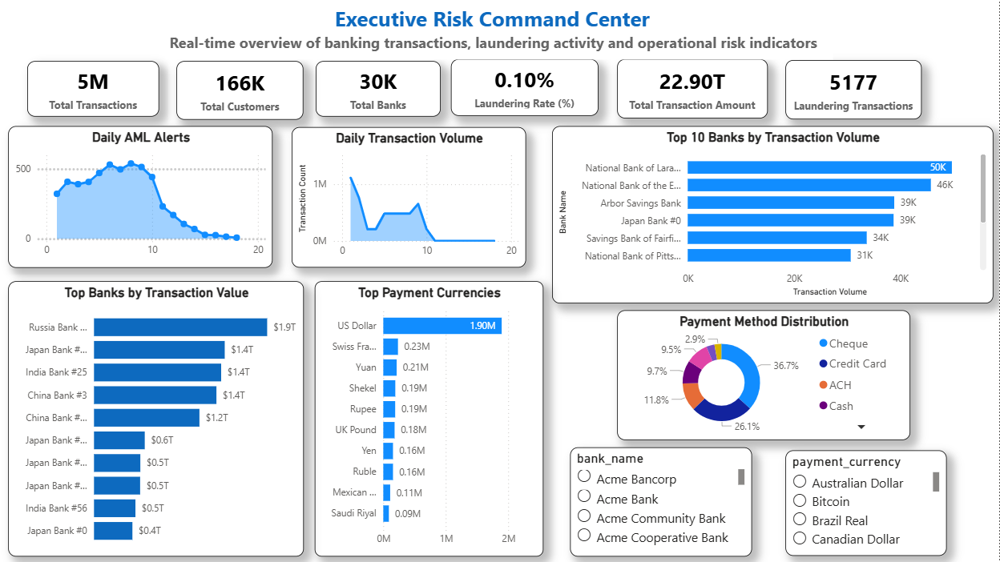
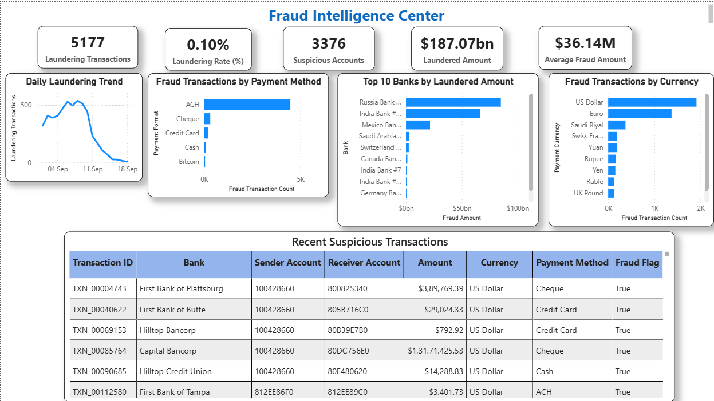
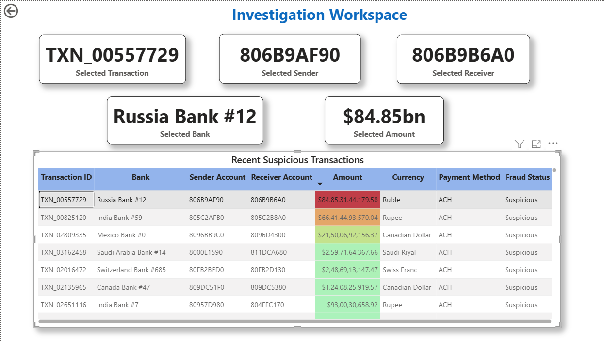
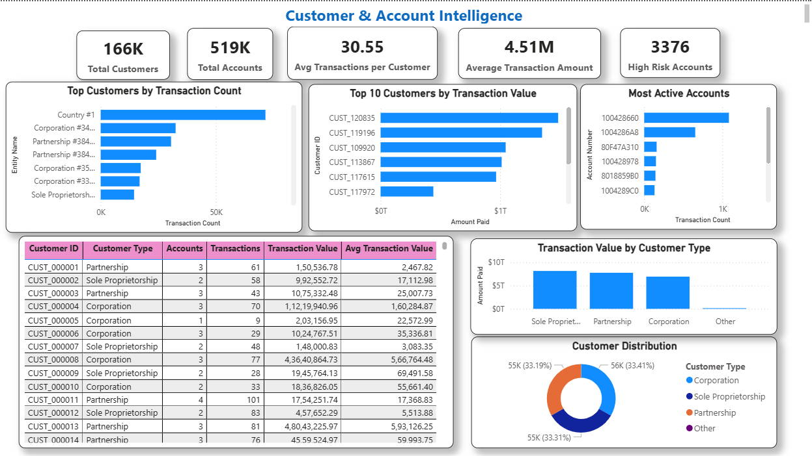
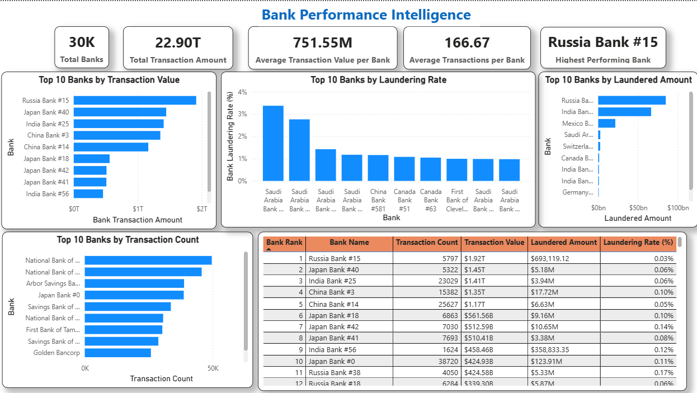
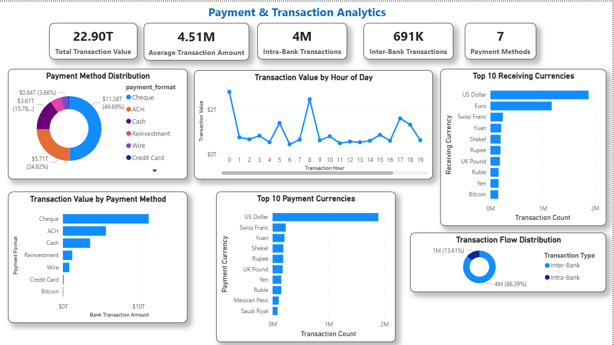
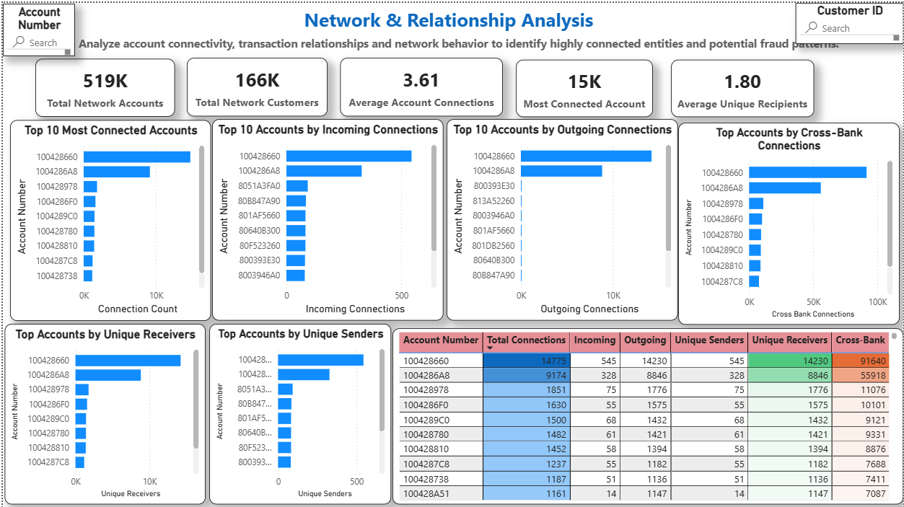
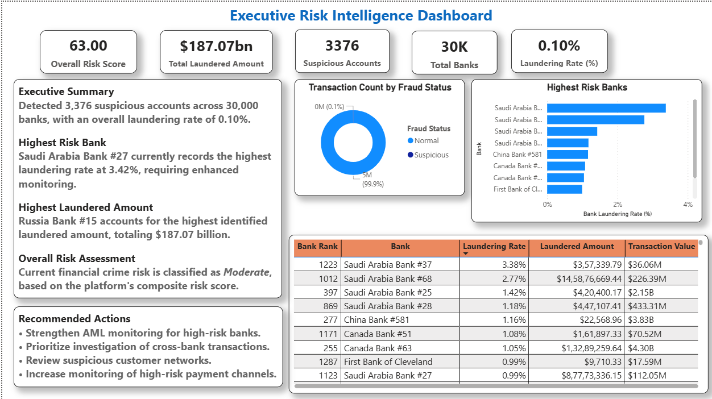
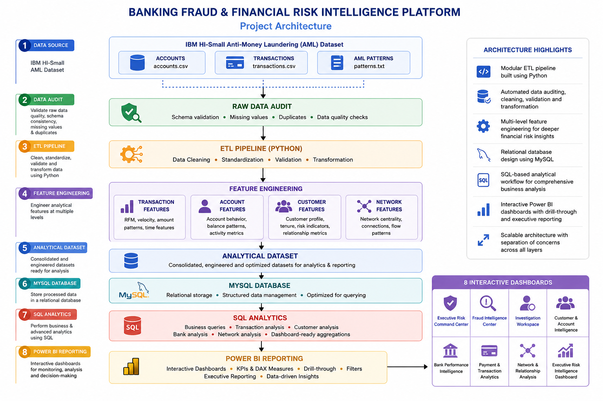

# 🏦 Banking Fraud & Financial Risk Intelligence Platform

An end-to-end **Financial Data Engineering and Business Intelligence** platform designed to transform large-scale banking transaction data into actionable fraud detection and financial risk insights. The project automates the complete analytics pipeline—from raw data auditing and cleaning to feature engineering, relational database management, SQL analytics and interactive Power BI reporting.

Built using the **IBM Anti-Money Laundering (AML) HI-Small dataset**, the platform processes approximately **5.08 million banking transactions** across **166K customers**, **519K accounts** and **30K banks**. The solution enables comprehensive analysis of transaction behavior, anti-money laundering (AML) activity, customer and account performance, bank-level risk indicators, payment trends and financial transaction networks.

The project follows a modular Python-based ETL architecture, stores processed data in a MySQL database and delivers executive-level business intelligence through eight interactive Power BI dashboards. The platform emphasizes robust data engineering, feature engineering, SQL analytics and interactive business intelligence to support fraud investigation and strategic decision-making.

---

## 🚀 Key Highlights

- Built an end-to-end ETL pipeline using Python for auditing, cleaning, validation, transformation and feature engineering.
- Processed approximately **5.08 million** banking transactions from the IBM HI-Small AML dataset.
- Engineered transaction, account, customer and network-level analytical features for fraud and financial risk analysis.
- Designed and managed a relational MySQL database for structured storage and analytical querying.
- Developed SQL modules for transaction, customer, bank and network analysis.
- Built **8 interactive Power BI dashboards** with drill-through capabilities for executive reporting and fraud investigation.
- Created DAX measures, KPIs, and interactive visualizations to monitor AML activity, transaction behavior, customer intelligence, banking performance and financial risk indicators.

# 📊 Dashboard Preview

The platform includes **8 interactive Power BI dashboards** designed to provide comprehensive visibility into banking transactions, anti-money laundering (AML) activities, fraud patterns, customer behavior, banking performance, payment analytics, transaction networks and executive-level risk intelligence.

Each dashboard focuses on a specific analytical domain while supporting interactive filtering, drill-through navigation and business-driven decision-making.

---

## 1. Executive Risk Command Center

**Purpose:** Provides a real-time executive overview of banking operations, transaction activity, AML indicators, transaction volumes, payment trends and bank performance.

<p align="center">
  
</p>

---

## 2. Fraud Intelligence Center

**Purpose:** Monitors suspicious transactions, laundering activity, fraud trends, high-risk banks, payment methods, currencies and recent suspicious transactions.

<p align="center">
  
</p>

---

## 3. Investigation Workspace (Drill-Through)

**Purpose:** Enables detailed investigation of suspicious transactions by displaying selected transaction details, sender and receiver accounts, transaction amounts and fraud status.

<p align="center">
  
</p>

---

## 4. Customer & Account Intelligence

**Purpose:** Analyzes customer activity, account behavior, transaction value, customer segmentation and high-risk accounts to support customer-centric risk analysis.

<p align="center">
  
</p>

---

## 5. Bank Performance Intelligence

**Purpose:** Evaluates banking performance using transaction value, transaction volume, laundering rates, laundered amounts and comparative bank rankings.

<p align="center">
  
</p>

---

## 6. Payment & Transaction Analytics

**Purpose:** Examines transaction values, payment methods, payment currencies, receiving currencies, hourly transaction patterns and transaction flow distribution.

<p align="center">
  
</p>

---

## 7. Network & Relationship Analysis

**Purpose:** Visualizes transaction connectivity by analyzing incoming and outgoing relationships, cross-bank interactions, network connectivity and account-level transaction networks.

<p align="center">
  
</p>

---

## 8. Executive Risk Intelligence Dashboard

**Purpose:** Consolidates enterprise-level KPIs, executive summaries, risk scores, laundering metrics, high-risk banks and strategic recommendations for senior decision-makers.

<p align="center">
  
</p>

# 📖 About the Project

The **Banking Fraud & Financial Risk Intelligence Platform** is an end-to-end **Financial Data Engineering and Business Intelligence** solution that transforms raw banking transaction data into meaningful fraud and financial risk insights.

The project begins with the **IBM Anti-Money Laundering (AML) HI-Small dataset**, where raw banking transactions, account information and AML pattern data are audited, cleaned, validated and transformed through a modular Python ETL pipeline. During this process, multiple analytical features are engineered at the transaction, account, customer and network levels to enhance downstream analysis.

The processed datasets are then loaded into a **MySQL relational database**, where SQL is used to perform exploratory analysis, business queries and dashboard-ready aggregations. Finally, the curated data is visualized in **Power BI** through interactive dashboards that support fraud monitoring, AML analysis, customer intelligence, banking performance evaluation, transaction analytics, network analysis and executive-level risk reporting.

The platform emphasizes **data engineering, feature engineering, relational database design, SQL analytics and business intelligence**, providing a structured analytical workflow for understanding financial transaction behavior without relying on machine learning models.

---

## 🔄 End-to-End Workflow

```text
IBM HI-Small AML Dataset
            │
            ▼
      Raw Data Audit
            │
            ▼
 Data Cleaning & Transformation
            │
            ▼
     Data Validation
            │
            ▼
    Feature Engineering
(Transaction • Account • Customer • Network)
            │
            ▼
   Analytical Dataset Creation
            │
            ▼
      MySQL Database
            │
            ▼
       SQL Analytics
            │
            ▼
 Interactive Power BI Dashboards
            │
            ▼
 Business Insights & Executive Reporting
```

---

## ⚙️ Workflow Stages

| Stage | Description |
|--------|-------------|
| **Raw Data Audit** | Audits the original IBM AML datasets to verify file integrity, schema consistency and data quality before processing. |
| **Data Cleaning & Transformation** | Cleans, standardizes and structures transaction, account, bank, customer and AML pattern datasets for downstream processing. |
| **Data Validation** | Verifies dataset consistency, referential integrity, duplicate records and expected schema after cleaning. |
| **Feature Engineering** | Generates transaction-level, account-level, customer-level and network-level analytical features to support fraud and financial risk analysis. |
| **Analytical Dataset** | Consolidates engineered features into a centralized dataset optimized for reporting and visualization. |
| **MySQL Database** | Stores the processed datasets in a relational database to enable efficient querying and structured data management. |
| **SQL Analytics** | Performs transaction, customer, bank, payment and network analysis through modular SQL scripts. |
| **Power BI Reporting** | Delivers interactive dashboards with KPIs, DAX measures, drill-through analysis, filters and executive reporting capabilities. |

# 💼 Business Problem

Financial institutions process **millions of transactions every day**, making it increasingly difficult to identify suspicious financial activities through manual monitoring alone. As transaction volumes grow across multiple banks, accounts, payment methods and currencies, analysts require reliable data engineering and business intelligence solutions to transform raw financial data into actionable insights.

Anti-Money Laundering (AML) investigations often involve analyzing complex transaction relationships, identifying unusual transaction patterns, monitoring customer and account behavior, and evaluating customer, account and bank-level risk indicators. Without a structured analytical platform, these activities can become time-consuming, fragmented and difficult to scale.

This project addresses these challenges by building a centralized analytics platform that integrates data engineering, feature engineering, relational database management, SQL analytics and interactive business intelligence.. The platform enables analysts to explore transaction behavior, monitor AML-related activities, evaluate customer and banking performance, investigate suspicious transactions, analyze financial networks and support executive decision-making through interactive dashboards.

---

## 🎯 Key Business Challenges

- Monitor large-scale banking transactions across multiple financial institutions.
- Analyze Anti-Money Laundering (AML) activities using structured transaction data.
- Identify suspicious transaction patterns for further investigation.
- Evaluate customer and account behavior using engineered analytical features.
- Analyze transaction relationships and cross-bank interactions through network analytics.
- Monitor bank-level transaction performance and financial risk indicators.
- Support data-driven decision-making through executive dashboards and interactive reporting.
- Consolidate financial data into a centralized analytical platform for business intelligence and operational reporting.

# 🎯 Project Objectives

The primary objective of the **Banking Fraud & Financial Risk Intelligence Platform** is to build a scalable **Financial Data Engineering and Business Intelligence** solution that transforms raw banking transaction data into meaningful analytical insights through a structured ETL pipeline, relational database management, SQL analytics and interactive Power BI reporting.

The project is designed to achieve the following objectives:

- Develop an end-to-end ETL pipeline to audit, clean, validate and transform raw banking transaction data.
- Engineer transaction, account, customer and network-level features to support fraud and financial risk analysis.
- Design and manage a relational MySQL database for efficient storage, querying and analytical processing.
- Perform SQL-based analysis to evaluate transaction behavior, customer activity, banking performance, payment trends and transaction networks.
- Build interactive Power BI dashboards that enable comprehensive monitoring of Anti-Money Laundering (AML) activities and financial risk indicators.
- Support investigation of suspicious transactions through interactive drill-through reporting and detailed analytical views.
- Deliver executive-level dashboards that summarize key business metrics, operational performance and financial risk insights.
- Demonstrate practical application of modern data engineering, feature engineering, relational database design, SQL analytics and business intelligence within a large-scale financial analytics workflow.

# 🛠️ Technology Stack

The project leverages a modern data engineering and business intelligence stack to build an end-to-end analytics platform. Each technology was selected to support a specific stage of the data pipeline, from ETL and database management to business intelligence and interactive reporting.

| Technology | Purpose |
|------------|---------|
| **Python** | Developed the end-to-end ETL pipeline, including data auditing, cleaning, validation, transformation and feature engineering. |
| **Pandas** | Processed, transformed, aggregated and analyzed large-scale tabular datasets. |
| **NumPy** | Performed numerical operations and supported efficient data manipulation during feature engineering. |
| **MySQL** |Designed and managed a relational database for storing processed datasets, supporting structured data management and analytical querying. |
| **SQL** | Developed SQL scripts for exploratory analysis, transaction analytics, customer intelligence, banking analysis, network analysis and dashboard-ready aggregations. |
| **Power BI** | Designed and developed eight interactive dashboards for fraud monitoring, AML analysis, executive reporting and financial risk intelligence. |
| **DAX (Data Analysis Expressions)** | Created KPIs, calculated measures, calculated columns and interactive business metrics within Power BI. |
| **Visual Studio Code** | Primary development environment for Python scripting, SQL development and project organization. |
| **Git** | Version control for tracking project development and code changes. |
| **GitHub** | Repository hosting, documentation, project versioning and portfolio presentation. |

---

## 💡 Technologies by Project Layer

| Project Layer | Technologies Used |
|---------------|-------------------|
| **Data Processing & ETL** | Python, Pandas, NumPy |
| **Feature Engineering** | Python, Pandas, NumPy |
| **Database Management** | MySQL |
| **Data Analysis** | SQL |
| **Business Intelligence** | Power BI, DAX |
| **Development Environment** | Visual Studio Code |
| **Version Control** | Git, GitHub |

# 🏗️ Project Architecture

The **Banking Fraud & Financial Risk Intelligence Platform** follows a modular data engineering architecture that transforms raw banking transaction data into interactive business intelligence dashboards through a structured ETL workflow.

The architecture is organized into distinct processing layers, where each stage performs a specific responsibility—from data auditing and cleaning to feature engineering, relational database management, SQL analytics and executive reporting.

---

## 🏛️ System Architecture

<p align="center">
  
</p>

<p align="center">
<i>Figure 1. End-to-end architecture of the Banking Fraud & Financial Risk Intelligence Platform.</i>
</p>
---

## 🔄 Architecture Overview

| Layer | Description |
|--------|-------------|
| **Data Source** | IBM HI-Small Anti-Money Laundering (AML) dataset containing accounts, transactions and AML pattern data. |
| **Data Audit** | Validates raw datasets by checking schema consistency, missing values, duplicates and overall data quality before processing. |
| **ETL Pipeline** | Cleans, standardizes, validates and transforms raw banking datasets using modular Python scripts. |
| **Feature Engineering** | Generates transaction, account, customer and network-level analytical features to support financial risk analysis. |
| **Analytical Dataset** | Consolidates engineered features into reporting-ready datasets optimized for SQL analytics and visualization. |
| **MySQL Database** | Stores processed datasets in a relational database for structured querying and efficient data management. |
| **SQL Analytics** | Performs business analysis, transaction analysis, customer analysis, network analysis, bank analysis and dashboard-ready aggregations. |
| **Power BI Reporting** | Delivers interactive dashboards with KPIs, DAX measures, drill-through capabilities, filters and executive reporting. |

---

## ⭐ Architecture Highlights

- Modular Python ETL pipeline for auditing, cleaning, validation and transformation.
- Multi-level feature engineering across transaction, account, customer and network datasets.
- Relational MySQL database supporting structured analytical queries.
- SQL-based analytical layer for business reporting and dashboard-ready aggregations.
- Eight interactive Power BI dashboards with KPIs, DAX measures, filters and drill-through analysis.
- Layered architecture that separates data ingestion, processing, storage, analytics and visualization.

# 📂 Dataset Overview

The **Banking Fraud & Financial Risk Intelligence Platform** is built using the **IBM Anti-Money Laundering (AML) HI-Small Dataset**, a synthetic financial dataset that simulates real-world banking transactions and money laundering activities. The dataset was obtained from **Kaggle** and is widely used for financial analytics, anti-money laundering (AML) research, fraud analysis and business intelligence applications.

The dataset models interactions between customers, accounts, banks and financial transactions, while also providing labeled laundering activities that enable comprehensive analytical reporting. Throughout this project, the original **September 2022** transaction timeline has been preserved without modification.

---

## 📊 Dataset Statistics

| Metric | Value |
|---------|------:|
| **Dataset Source** | IBM Anti-Money Laundering (AML) HI-Small Dataset |
| **Platform** | Kaggle |
| **Total Transactions** | **5.08 Million** |
| **Total Customers** | **166K** |
| **Total Accounts** | **519K** |
| **Total Banks** | **30K** |
| **Transaction Period** | **September 2022** |
| **Fraud Labels** | Normal / Laundering |
| **Payment Methods** | 7 |
| **Currencies** | Multiple Supported |

---

# 📁 Raw Dataset Structure

The original dataset consists of three primary files that collectively represent the banking ecosystem.

| Dataset | Description |
|----------|-------------|
| **HI-Small_Accounts.csv** | Contains account information, customer mappings, bank identifiers, account numbers and entity details. |
| **HI-Small_Trans.csv** | Stores banking transactions including timestamps, sender and receiver accounts, transaction amounts, currencies, payment methods and laundering labels. |
| **HI-Small_Patterns.txt** | Contains structured Anti-Money Laundering (AML) transaction patterns describing known money laundering typologies. |

---

## 💳 Transaction Attributes

Each transaction record contains the following key information:

| Attribute | Description |
|-----------|-------------|
| **Timestamp** | Date and time of the transaction |
| **From Bank** | Sender bank identifier |
| **Sender Account** | Originating account number |
| **To Bank** | Receiver bank identifier |
| **Receiver Account** | Destination account number |
| **Amount Paid** | Amount transferred by the sender |
| **Payment Currency** | Currency used by the sender |
| **Amount Received** | Amount received by the beneficiary |
| **Receiving Currency** | Currency received by the beneficiary |
| **Payment Method** | Transaction payment channel |
| **Laundering Label** | Indicates whether the transaction is labeled as laundering |

---

## 📌 Dataset Characteristics

The dataset provides a realistic representation of a large-scale banking environment and supports multiple analytical perspectives throughout the project.

- Simulates a multi-bank financial ecosystem with approximately **30,000 banks**.
- Contains over **5 million** financial transactions spanning multiple payment methods and currencies.
- Models relationships between customers, accounts, banks and financial transactions.
- Includes labeled laundering transactions to support Anti-Money Laundering (AML) analysis.
- Enables customer, account, transaction, bank and network-level analytics through engineered features.
- Preserves realistic transaction flows suitable for business intelligence and financial risk reporting.

---

## 🔄 Role of the Dataset in This Project

The raw IBM HI-Small dataset serves as the foundation of the complete analytics pipeline.

```text
IBM HI-Small AML Dataset
            │
            ▼
Python ETL Pipeline
            │
            ▼
Feature Engineering
            │
            ▼
MySQL Database
            │
            ▼
SQL Analytics
            │
            ▼
Power BI Dashboards
```

The processed data ultimately powers **eight interactive Power BI dashboards**, providing insights into transaction behavior, Anti-Money Laundering (AML) activities, customer intelligence, bank performance, network relationships, and executive-level financial risk reporting.

# ⚙️ ETL Pipeline

The Banking Fraud & Financial Risk Intelligence Platform follows a **modular Extract, Transform, Load (ETL) pipeline** developed in Python. Rather than performing all processing within a single script, the pipeline is divided into independent stages, where each module performs a specific responsibility such as data auditing, cleaning, validation, feature engineering or analytical dataset generation.

This modular architecture improves maintainability, simplifies debugging and enables each stage of the data engineering workflow to be executed and validated independently.

---

## 🔄 ETL Workflow

```text
IBM HI-Small AML Dataset
            │
            ▼
01. Raw Data Audit
            │
            ▼
02. Data Cleaning
            │
            ▼
03. Data Validation
            │
            ▼
04. Feature Engineering
            │
            ▼
05. Analytical Dataset Creation
            │
            ▼
MySQL Database
            │
            ▼
Power BI Dashboards
```

---

## 📂 ETL Pipeline Stages

| Stage | Python Script | Purpose |
|--------|---------------|---------|
| **1. Raw Data Audit** | `01_raw_data_audit.py` | Audits the raw IBM HI-Small dataset by examining file structure, data types, missing values, duplicate records and overall data quality before processing. |
| **2. Account Cleaning** | `02_clean_accounts.py` | Cleans and standardizes account data, validates account information and prepares it for downstream processing. |
| **3. Transaction Cleaning** | `03_clean_transactions.py` | Cleans banking transaction records, standardizes transaction attributes and prepares high-volume transaction data for analysis. |
| **4. AML Pattern Cleaning** | `04_clean_patterns.py` | Cleans and structures AML pattern definitions for integration into the analytical workflow. |
| **5. Data Validation** | `05_validate_cleaned_data.py` | Verifies cleaned datasets by checking schema consistency, duplicates, missing values and data integrity. |
| **6. Transaction Feature Engineering** | `06_derive_transaction_features.py` | Generates transaction-level analytical features including payment behavior, transaction characteristics and engineered risk indicators. |
| **7. Account Feature Engineering** | `07_derive_account_features.py` | Derives account-level features such as transaction statistics, activity metrics and account behavior indicators. |
| **8. Customer Feature Engineering** | `08_derive_customer_features.py` | Aggregates account information into customer-level analytical features for customer intelligence and behavioral analysis. |
| **9. Network Feature Engineering** | `09_derive_network_features.py` | Builds relationship-based features by analyzing account connectivity, transaction networks and cross-bank interactions. |
| **10. Analytical Dataset Generation** | `10_build_analytical_dataset.py` | Combines all engineered datasets into a consolidated analytical dataset optimized for MySQL loading and Power BI reporting. |

---

## 🏗️ ETL Design Principles

The ETL pipeline was designed around the following principles:

- Modular Python scripts with clearly defined responsibilities.
- Independent execution of each processing stage.
- Progressive data quality validation throughout the pipeline.
- Separation of raw, cleaned, derived and analytical datasets.
- Feature engineering performed at multiple analytical levels.
- Reporting-ready datasets optimized for SQL analytics and Power BI visualization.

---

## 📁 ETL Output Structure

The ETL pipeline produces structured datasets that are organized into separate processing layers, enabling clear separation between raw, cleaned, engineered and analytical data assets.

```text
DATA
│
├── RAW
│   ├── HI-Small_Accounts.csv
│   ├── HI-Small_Trans.csv
│   └── HI-Small_Patterns.txt
│
├── CLEANED
│   ├── accounts.csv
│   ├── transactions.csv
│   ├── banks.csv
│   ├── customers.csv
│   ├── aml_patterns.csv
│   └── aml_pattern_transactions.csv
│
├── DERIVED
│   ├── transaction_features.csv
│   ├── account_features.csv
│   ├── customer_features.csv
│   └── network_features.csv
│
└── ANALYTICS
    └── analytical_dataset.csv


## 📁 Python ETL Scripts

The complete ETL pipeline is organized under the **SCRIPTS** directory, where each module performs an independent stage of the data engineering workflow.

```text
SCRIPTS
├── AUDIT
│   └── 01_raw_data_audit.py
├── CLEANING
│   ├── 02_clean_accounts.py
│   ├── 03_clean_transactions.py
│   └── 04_clean_patterns.py
├── VALIDATION
│   └── 05_validate_cleaned_data.py
├── DERIVATION
│   ├── 06_derive_transaction_features.py
│   ├── 07_derive_account_features.py
│   ├── 08_derive_customer_features.py
│   └── 09_derive_network_features.py
└── ANALYTICS
    └── 10_build_analytical_dataset.py
```
# 🗄️ Database Design

The Banking Fraud & Financial Risk Intelligence Platform utilizes a **MySQL relational database** as the central storage layer between the Python ETL pipeline and the Power BI reporting environment. After data cleaning and feature engineering, the processed datasets are loaded into MySQL, where they are organized into structured relational tables for efficient querying, analysis, and dashboard integration.

The database serves as the analytical backbone of the platform by enabling SQL-based exploration, business reporting, feature aggregation, and dashboard-ready data retrieval.

---

## 🏛️ Database Architecture

```text
Python ETL Pipeline
         │
         ▼
 Cleaned Datasets
         │
         ▼
 Feature Engineering
         │
         ▼
 Analytical Dataset
         │
         ▼
 MySQL Database
         │
         ▼
 SQL Analysis
         │
         ▼
 Power BI
```

---

## 📂 Database Tables

The database is organized into multiple logical tables representing banking entities, transactions, engineered features and analytical datasets.

| Table | Description |
|--------|-------------|
| **accounts** | Stores cleaned customer account information and bank mappings. |
| **banks** | Contains bank identifiers and bank-related reference information. |
| **customers** | Stores customer-level information derived from account mappings. |
| **transactions** | Contains cleaned banking transaction records used for financial analysis. |
| **aml_patterns** | Stores Anti-Money Laundering (AML) pattern definitions. |
| **aml_pattern_transactions** | Maps transactions to identified AML patterns. |
| **transaction_features** | Stores engineered transaction-level analytical features. |
| **account_features** | Stores engineered account-level metrics and behavioral features. |
| **customer_features** | Stores customer-level analytical and behavioral features. |
| **network_features** | Stores network connectivity and relationship metrics between accounts. |
| **analytical_dataset** | Consolidated reporting dataset optimized for SQL analytics and Power BI dashboards. |

---

## 🔗 Database Relationships

The relational database is designed around interconnected banking entities.

| Parent Table | Related Table | Relationship |
|--------------|---------------|--------------|
| **customers** | **accounts** | One customer can own multiple accounts. |
| **banks** | **accounts** | One bank manages multiple accounts. |
| **accounts** | **transactions** | Accounts participate as sender and receiver in transactions. |
| **transactions** | **transaction_features** | One-to-one relationship through Transaction ID. |
| **accounts** | **account_features** | One-to-one relationship through Account ID. |
| **customers** | **customer_features** | One-to-one relationship through Customer ID. |
| **accounts** | **network_features** | Derived relationship based on account connectivity. |
| **transactions** | **aml_pattern_transactions** | Transactions mapped to AML pattern records. |

---

## 🔑 Primary Keys

| Table | Primary Key |
|--------|-------------|
| accounts | Account ID |
| customers | Customer ID |
| banks | Bank ID |
| transactions | Transaction ID |
| aml_patterns | Pattern ID |
| aml_pattern_transactions | Pattern Transaction ID |
| transaction_features | Transaction ID |
| account_features | Account ID |
| customer_features | Customer ID |
| network_features | Account ID |
| analytical_dataset | Transaction ID |

---

## ⚡ Database Design Highlights

- Normalized relational database structure.
- Separate storage for raw entities and engineered analytical features.
- Optimized for SQL-based analytical querying.
- Supports customer, account, bank, transaction and network analysis.
- Provides dashboard-ready datasets for Power BI.
- Designed to integrate seamlessly with the modular Python ETL pipeline.

---

## 🏗️ Database Design Principles

The MySQL database was designed to support scalable analytical reporting while maintaining a clear separation between operational entities and engineered analytical features.

The design follows several core principles:

- Normalized storage for core banking entities.
- Independent feature tables for analytical processing.
- Separation between transactional and reporting datasets.
- SQL-friendly schema for efficient aggregations and business queries.
- Optimized structure for Power BI star-schema modeling.


## 🔄 Data Flow into the Database

```text
Raw Dataset
      │
      ▼
Python ETL
      │
      ▼
Cleaned Tables
      │
      ▼
Feature Engineering
      │
      ▼
MySQL Database
      │
      ▼
SQL Analytics
      │
      ▼
Power BI Dashboards
```
